# LabelRM-Winter-2025 
总之，标好数据后先将其放置在这📁。

## 标签格式规范 📋
为了便于操作与管理，LabelMaster 的输出格式采用特定规则：每一个图片均对应一个与其同名的txt文件作为标签文件 📄。在该标签文件中，每一行代表一个目标，具体每行的格式如下：
```bash
[目标各点的x、y归一化坐标] <目标类id> <目标颜色id>
```

### 详细说明
1. **目标点顺序**：目标点的顺序严格遵循LabelMaster中的标注顺序 📏。这确保了数据标注的一致性与准确性，方便后续对标注数据的解析与使用。就如同我们在地图上标记地点，每个标记都有特定的顺序，这样才能准确地找到对应的位置，数据标注也是如此。

2. **目标类id**：目标类id与LabelMaster中的标签顺序一致。具体各类目标对应的ID如下表所示：


<div align="center">

| 贴纸 | ID | 说明 |
| :--: | :--: | :--: |
| G | 0 | 哨兵 |
| 1 | 1 | 一号 |
| 2 | 2 | 二号 |
| 3 | 3 | 三号 |
| 4 | 4 | 四号 |
| 5 | 5 | 五号 |
| O | 6 | 前哨站 |
| Bs | 7 | 基地 |
| Bb | 8 | 基地大装甲 |
| L3 | 9 | 三号平衡 |
| L4 | 10 | 四号平衡 |
| L5 | 11 | 五号平衡 |

</div>

3. **颜色ID**：颜色ID对应关系如下表所示：

<div align="center">

| 类别 | color | 说明 |
| :--: | :--: | :--: |
| Blue | 0 | 蓝色🔵 |
| Red | 1 | 红色🔴 |
| Negative | 2 | 熄灭🔅 |
| Purple | 3 | 紫色🟣 |

</div>

## 标注要求

### 目标要求
- 图片中所有符合以下要求的目标都需要全部标注：
  - 装甲板被遮挡（包括超出图片边界）的部分要少于30%。
  - 装甲板灯条至少有一条露出70% 。
  - 装甲板贴纸必须肉眼容易识别。
  - 装甲板表面平面与图片平面二面角应当小于80度。

### 标注要点
- 白色（熄灭）、红色、蓝色、紫色的颜色类别与装甲板类型类别标注必须完全正确。
- 标签标注要点：
  - 调整装甲板目标的四个关键点，要做到**当图片放大到整个装甲板占据整个标注区时，蒙版的绿色线条恰好成为装甲板表面白色与黑色的分界线**。
  - 装甲板两侧凹槽与灯条最亮的部分要**互相平行且长度近乎相等**。
- 模板的四个圈无需理会 。

### 示例

#### 标准目标
这是标准状况下的数据集标注示例，在实际标注中，这是大家最常碰到的情况。

##### 标注要点
- **当图片放大使得整个装甲板占据整个标注区时，蒙版的绿色线条完全成为装甲板表面白色与黑色分界线**。
- 两侧凹槽不一定与灯条最亮的部分完全契合，但要在其附近，并且**互相平行且长度基本相等**（由于色散现象，灯条可能会看起来长一点）。

<div align="center">
    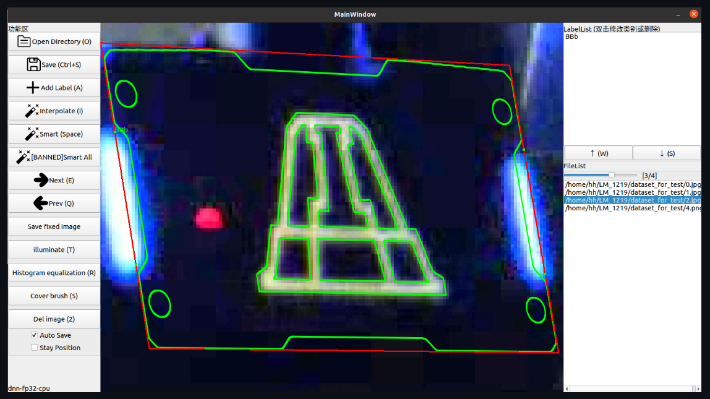
</div>

#### 拖影目标
下图展示的是严重拖影的示例，在实际标注过程中，一般不会遇到这么严重的情况。

##### 标注要点
- 要满足标准目标的标注要点。
- 白色高亮部分基本要位于图案线条框定的范围内。
- 颜色较暗的拖影部分可以不位于框定范围内。

<div align="center">
    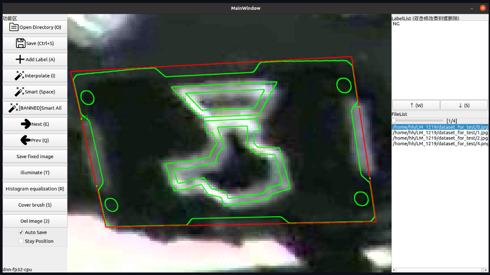
</div>

#### 小目标

##### 可见特征
- 放大后能看到像素颗粒较大。
- 灯条看起来更“胖” 。

##### 标注要点
- 图案线条中线要与模板线条中线重合。

<div align="center">
    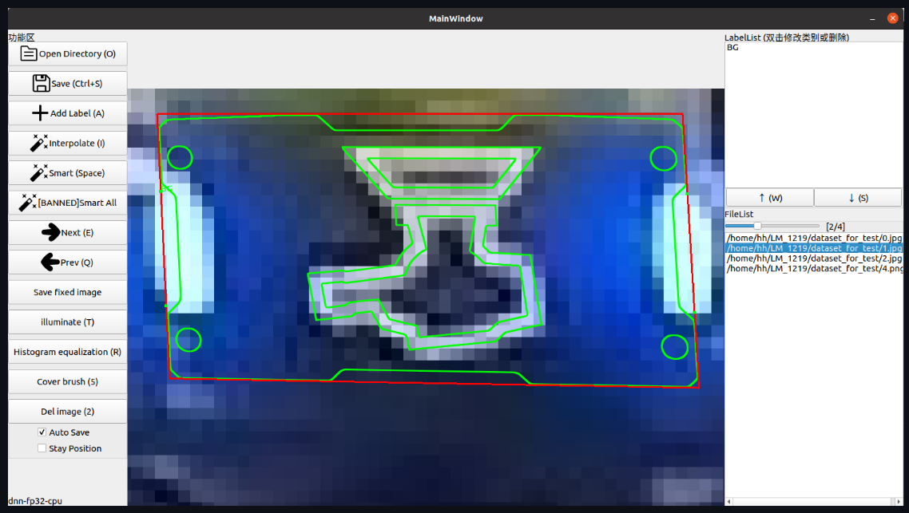
</div>

#### 色块丢失

##### 可见特征
- 比如“1”的左上角部分白色丢失。
- 整个画面像素呈现按块分布的情况（成块地发灰，成块地出现噪声）。

##### 标注要点
- 此时模板可以包含黑色部分。

<div align="center">
    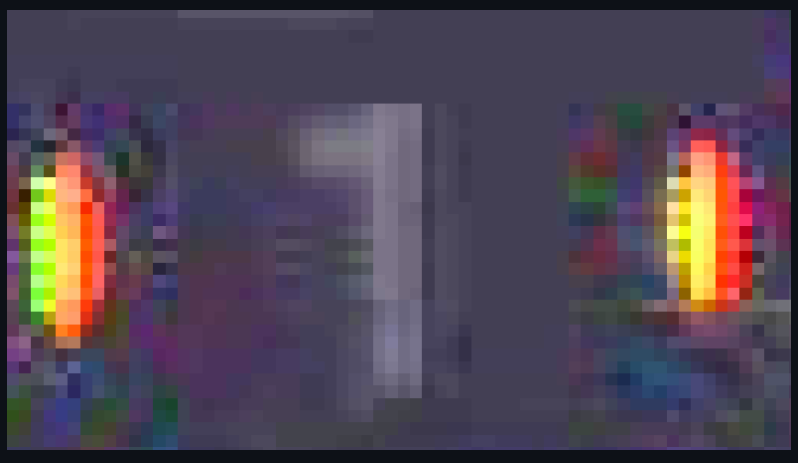
    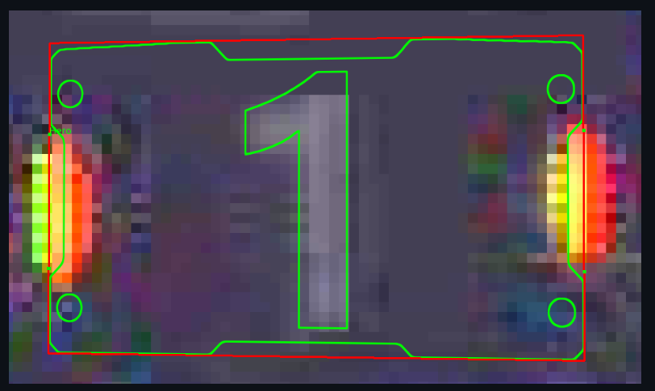
</div>

#### 侧对目标-空间位置关系
灯条与装甲板表面不在同一水平面上，在侧对时灯条的光会被装甲板表面遮挡；灯条为成块发光，在侧对时可见的发光面更大。

##### 可见特征
当左侧的灯条远离我们，右边的灯条靠近我们时：
- 远离我们的一侧灯条被装甲板表面遮挡，所以灯条更窄；靠近我们的一侧灯条发光面更大，灯条更宽。
- 当前装甲板表面朝向下，两侧关键点位置较该侧灯条最亮部分偏左。

<div align="center">
    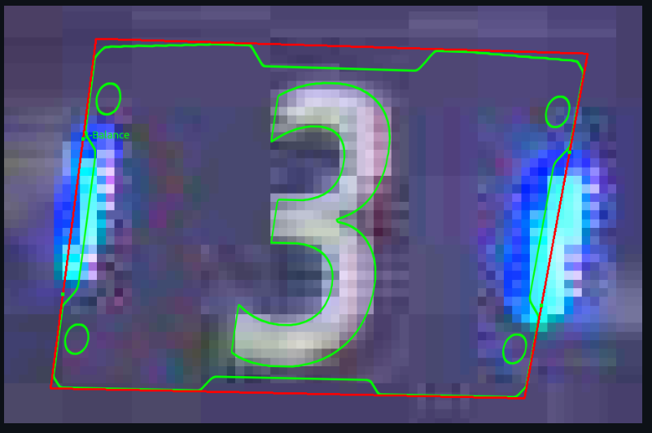
</div>

### 反例

反例无需标注。

> 装甲板被遮挡（包括超出图片边界）应当少于30%

<div align="center">
    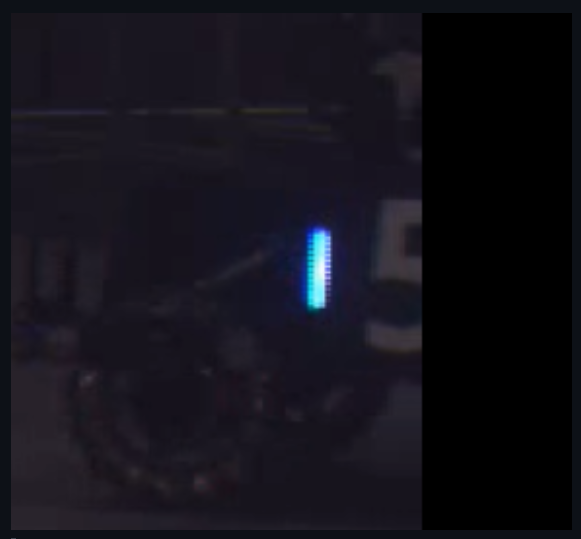
</div>

> 装甲板灯条至少有一条露出70%

<div align="center">
    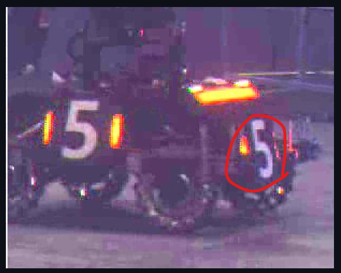
</div>

> 装甲板贴纸应肉眼容易识别
<div align="center">
    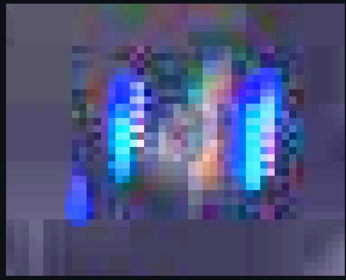
</div>

> 噪点
<div align="center">
    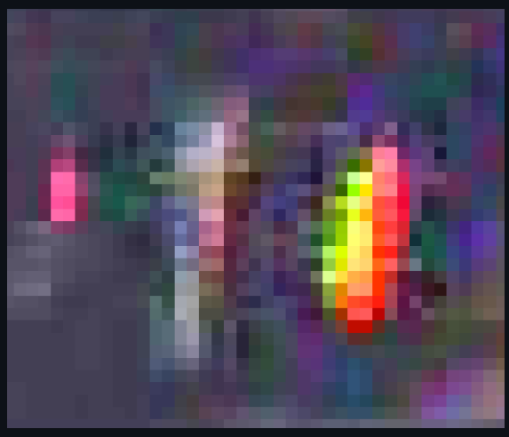
</div>

> 两个灯条应该与对应侧灯条平行
<div align="center">
    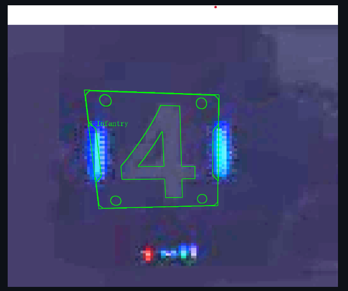
</div>

> 当一侧灯条缺失时该侧应与另一侧近乎平行
<div align="center">
    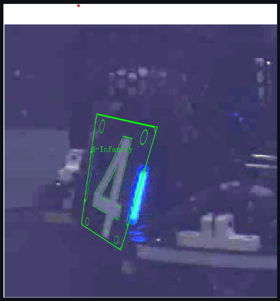
</div>

### 标注不完全

<div align="center">
    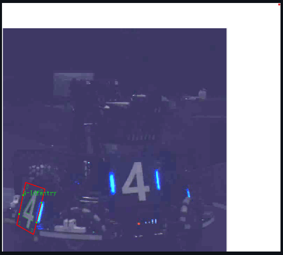
</div>

### 拖影说明

> 如何判断拖影
灯条真实位置位于灯条光圈最亮的部分（如图中红光最亮呈黄色，蓝光最亮呈白色）（仅装甲板正对时），将关键点拖至灯条真实位置，此时可见仍有大量颜色较暗的白色部分无法框入其中，此时认为存在拖影，将最亮的部分框进去。

<div align="center">
    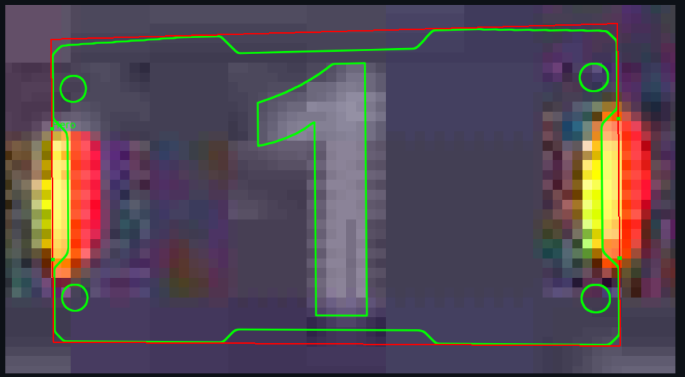
</div> 